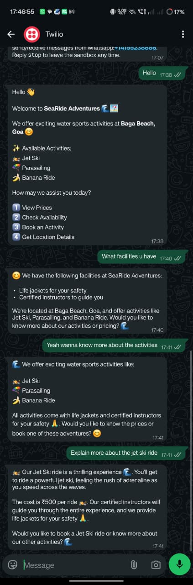
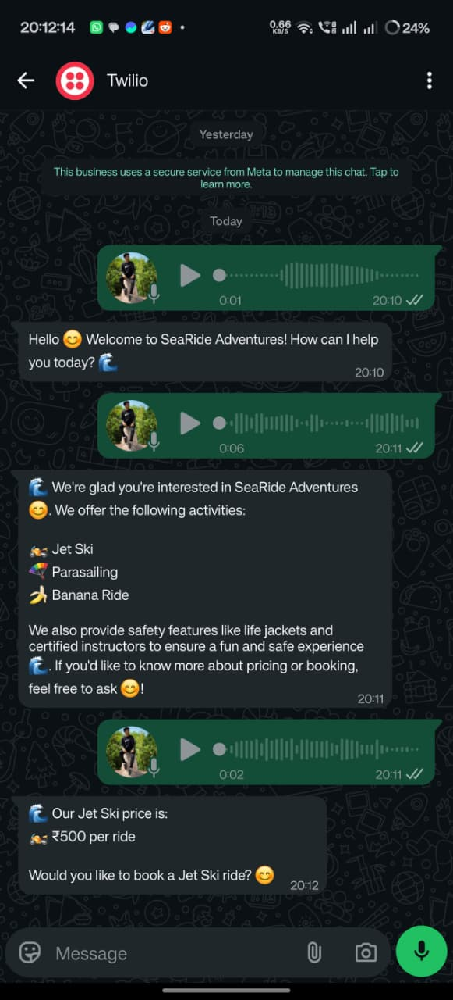

# WhatsApp Tourism Chatbot

An AI-powered WhatsApp chatbot built for tourism activity inquiries and bookings. The chatbot allows users to interact naturally through WhatsApp, explore tourism activities, make bookings, and receive instant responses in multiple languages.

---

## Features

### AI-Powered Chat Support
- Handles natural conversations with users
- Responds to tourism-related queries
- Provides booking assistance through chat

### WhatsApp Integration
- Users can communicate directly through WhatsApp
- Real-time messaging experience

### Activity Booking System
Users can:
- Select tourism activities
- Choose booking dates and time slots
- Enter personal details
- Confirm bookings instantly

### Multilingual Support
- Supports translation for regional languages
- Includes Konkani translation support
- Speech-to-text support for voice messages

---

## System Demonstration

### Text-Based Chat Interaction

The chatbot enables users to communicate through text messages on WhatsApp to inquire about tourism activities and complete bookings.

  

  <em>Figure 1: Text-based interaction with the tourism chatbot.</em>

### Voice-Based Chat Interaction

Users can also send voice messages through WhatsApp. The system converts speech into text using Deepgram API and generates appropriate responses.

  

  <em>Figure 2: Voice-based interaction using speech-to-text support.</em>

---
## Architecture

- **Backend:** Node.js + Express.js  
  (Handles WhatsApp messaging, AI replies, booking flow, Groq API integration, and user conversation management)

- **Speech-to-Text (STT):** Deepgram API  
  (Converts voice messages into text)

- **Translation Backend:** Python FastAPI  
  (Handles translation model execution)

- **Translation Model:** `konkani-gemma-3-4b-it`  
  (4-bit quantized model, translates English to Konkani)

- **Database:** MongoDB  
  (Stores bookings, activities, and user data)

- **WhatsApp Integration:** Twilio WhatsApp API  
  (Real-time communication with users through WhatsApp)

## Future Enhancements
- Online payment integration
- Multi-operator tourism support
- AI-based recommendation system
- Booking history and analytics
- Admin dashboard for operators

---

##  Project Goal
The main goal of this project is to simplify tourism activity inquiries and bookings through an intelligent WhatsApp chatbot that provides users with a fast, multilingual, and user-friendly experience.

---
